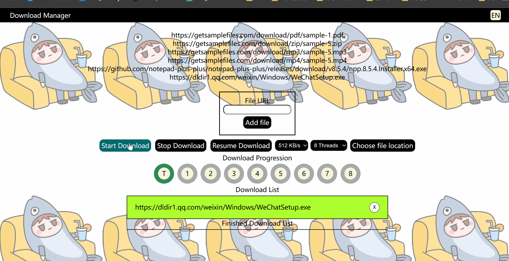
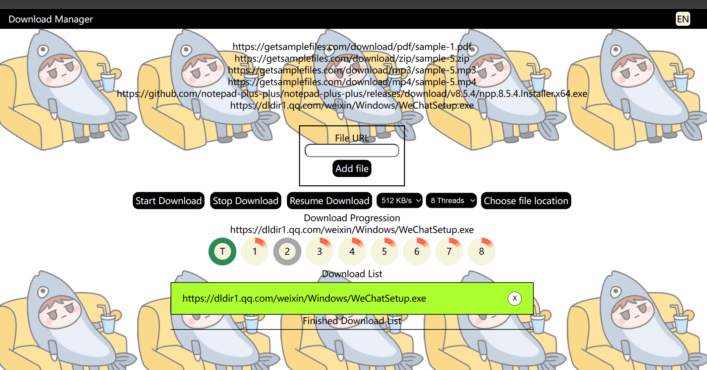
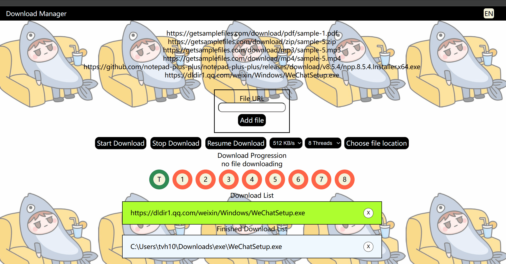

# 个人项目-并发文件下载助手
## 使用文档
1. 第一至第四文档
   1. [迭代一文档](./report/第一阶段迭代.md)
   2. [迭代二文档](./report/第二阶段迭代.md)
   3. [迭代三文档](./report/第三阶段迭代.md)
   4. [迭代四文档](./report/第四阶段迭代.md)
2. 程序使用方法
   1. 环境要求
      1. java jdk 1.8
      2. springboot 2.7.13
      3. mysql数据库
         1. 数据库设计看[迭代一文档](./report/第一阶段迭代.md)和[迭代二文档](./report/第二阶段迭代.md)
    2. 点击FileDownloaderApplication并开始使用。

## 项目介绍

**主要功能**
1. 多文件多线程下载
2. 可视化下载进度

3. 提供暂停和继续下载功能

4. 语言切换功能
