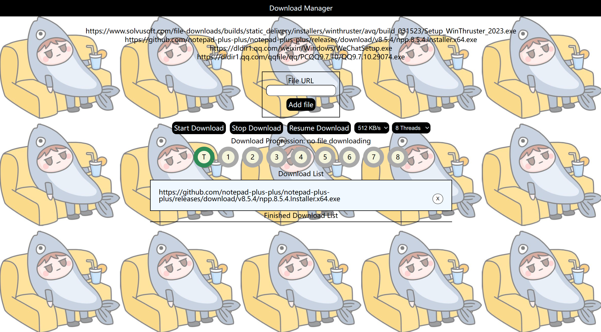
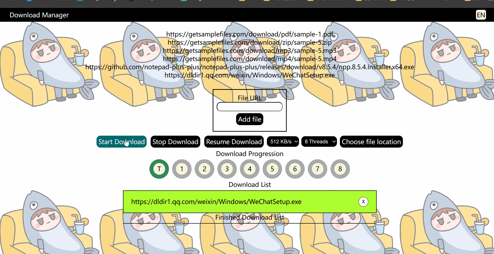
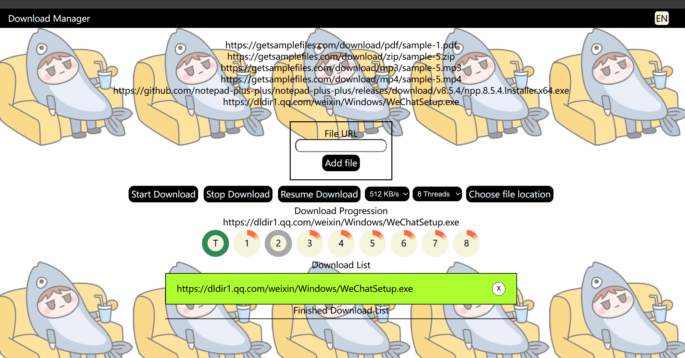
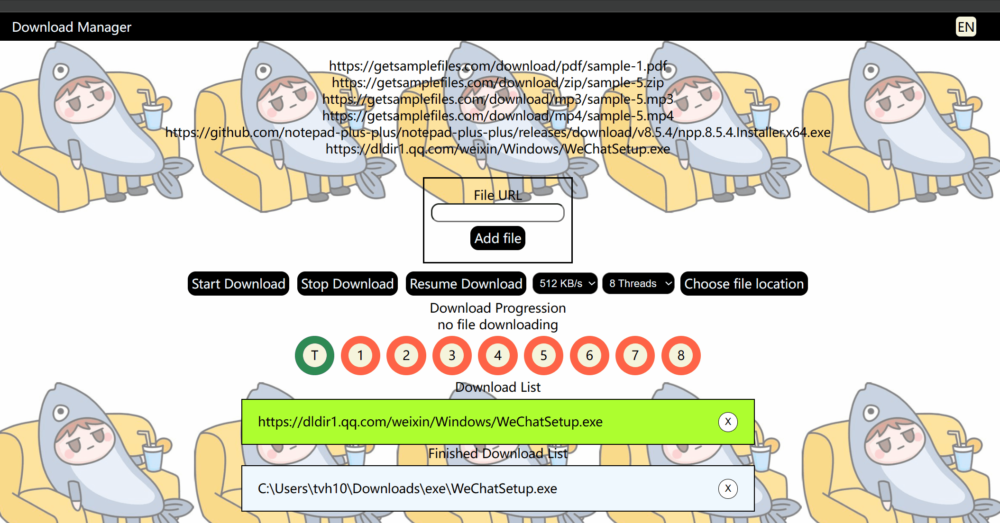

# Solo-project - Multithreaded File Downloader
## Documentation
1. First to Fourth Iteration
   1. [FirstIteration](./documents/Phase1/FirstIteration.md) [第一阶段报告](./documents/Phase1/第一阶段迭代.md)
   2. [SecondIteration](./documents/Phase2/SecondIteration.md) [第二阶段报告](./documents/Phase2/第二阶段迭代.md)
   3. [ThirdIteration](./documents/Phase3/ThirdIteration.md) [第三阶段报告](./documents/Phase3/第三阶段迭代.md)
   4. [FourthIteration](./documents/Phase4/FourthIteration.md) [第四阶段报告](./documents/Phase4/第四阶段迭代报告.md)
2. To use this software
   1. Environment
      1. java jdk 1.8
      2. springboot 2.7.13
      3. mysql
         1. Design in[FirstIteration](./documents/Phase1/FirstIteration.md) and [SecondIteration](./documents/Phase2/SecondIteration.md)
    2. run `FileDownloaderApplication`。

## About Project

**Main Function**
1. Multi file download with multi thread
2. Visual interface of download process

3. Provides pause and resume funciton

4. Language selection

# Things to add
- task list to make this application better
[Rebuild Project](./documents/RebuildProject.md)