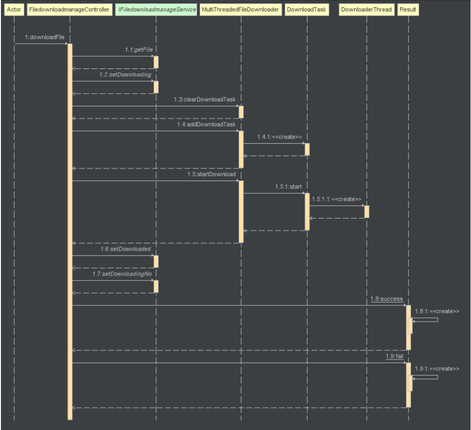

# Each Module Time Spent

| PSP                                     | Personal Software Process Stages        | 预估耗时（分钟） | 实际耗时（分钟） |
| --------------------------------------- | --------------------------------------- | ---------------- | ---------------- |
| Planning                                | 计划                                    | 60               | 50               |
| · Estimate                              | · 估计这个任务需要多少时间              | 1440             | 1080             |
| Development                             | 开发                                    | 1080             |                  |
| · Analysis                              | · 需求分析 (包括学习新技术)             | 360              | 360              |
| · Design Spec                           | · 生成设计文档                          | 60               | 60               |
| · Design Review                         | · 设计复审 (和同事审核设计文档)         | 60               | 60               |
| · Coding Standard                       | · 代码规范 (为目前的开发制定合适的规范) | 60               | 60               |
| · Design                                | · 具体设计                              | 120              | 100              |
| · Coding                                | · 具体编码                              | 480              | 480              |
| · Code Review                           | · 代码复审                              | 60               | 60               |
| · Test                                  | · 测试（自我测试，修改代码，提交修改）  | 360              | 360              |
| Reporting                               | 报告                                    | 360              | 360              |
| · Test Report                           | · 测试报告                              | 180              | 180              |
| · Size Measurement                      | · 计算工作量                            | 90               | 120              |
| · Postmortem & Process Improvement Plan | · 事后总结, 并提出过程改进计划          | 90               | 60               |
|                                         | 合计                                    | 2340             | 2350                 |

# Ideas for solving the problem
1. For programming language, i've firstly chosen python as main language, but after two phases, it is not what i wanted to make(Desktop application). So i rebuild the application using java, because i've previous experience in building web application using java and springboot
2. After looking at first iteration requirement
	1. Multi-threaded download, choose thread count
	2. Provides downlaod speed
	3. Detect if the Website provides multi-threaded download（Not implemented）
	4. Download file location
3. The main goal is Multi-threaded download. After several hour of researching, i've learned that i can set the header to request specific range like `connection.setRequestProperty("Range",range)`
4. Design a database to store downloaded file and it's location, make it a more general web file downloader. If in future added the user feature it will be useful


# Design implementation process
## Database Design
1. File
fileId got from fileUrl，fileSize gets from response，fileType and fileName got by analyzing the URL provided。use filePath to save the file save location。

| 属性     | 类型   |
| -------- | ------ |
| fileId   | int    |
| fileUrl  | string |
| fileName | string |
| fileType | string |
| fileSize | int    |
| filePath | string |


## MVC Backend Design


entity is POJO object which store the database tables as a Class，mapper are used connect to database and operate SQL，service for the main logic code，controller that act as the middleman of frontend and backend, which did analyzing the HTTP request[第四阶段迭代报告](/%E7%AC%AC%E5%9B%9B%E9%98%B6%E6%AE%B5%E8%BF%AD%E4%BB%A3.md)。

Mapper
```java
public void insertFile(File file);
```

```xml
<insert id="insertFile" parameterType="com.example.sys.entity.File">
    insert into file(fileId, fileUrl, fileName, fileType, fileSize,filePath) values(#{fileId},#{fileUrl},#{fileName},#{fileType},#{fileSize},#{filePath})
</insert>
```

## Class Design
1. `MultiThreadedFileDownloader.java` - The main class, it contains function such as start download, stop download, addfile, choose threads, etc
2. `DownloaderThread.java` - MultiThreaded Downlaod, Used to download file in multithreaded way


## startDownload sequential diagram


# Used JProfiler to track the performance

Found out that MultiThreadedFileDownloader used the most memory

# Code Explanation
Core：
When`http://127.0.0.1:8080/api/filedownloadmanage/download `sent to backend，it will start download the file, by following the sequential diagram above。

## MultiThreadedFileDownloader：
```java
public void addDownloadTask(List<Filedownloadmanage> fdmList, List<File> fileInfoList, int numThreads, int speed) throws MalformedURLException {  
    System.out.println("fdmList size: " + fdmList.size());  
    System.out.println("FileList size: " + fileInfoList.size());  
  
    threadDownloadProgressList = new ArrayList<>();  
    //初始化  
    for(int i =0 ; i < numThreads; i++){  
        this.threadDownloadProgressList.add(0);  
    }  
  
    System.out.println("Download progress list size " + threadDownloadProgressList.size());  
	
	//遍历文件进行下载
    for (File f: fileInfoList) {  
        String fileUrl = f.getFileUrl();  
  
        if(fileUrl != null){  
            URL url = new URL(fileUrl);  
            DownloadTask downloadTask = new DownloadTask(url,f.getFilePath(),numThreads);  
            downloadTasks.add(downloadTask);  
        }else{  
            System.out.println("Error getting fileUrl");  
        }  
  
    }  
    this.threads = numThreads;  
}

public void startDownload() {  
  
    for (DownloadTask task : downloadTasks) {  
        System.out.println("One file downloading: " + task.url);  
  
        //将该文件改为正在下载中  
        this.currentDownload = task.url.toString();  
		
        task.start();  
  
        System.out.println("One file downloaded: " + task.url);  
  
    }  
  
    this.currentDownload = null;  
}


```

## MultiThreadedFileDownloader.DownloadTask
```java
private class DownloadTask {  
    private final URL url;  
    private final String savePath;  
    private final int numThreads;  
  
    private DownloadTask(URL url, String savePath, int numThreads); //构造函数

	//文件下载开始
    public void start() {  
        try {  
            long contentLength = getContentLength();  
            long bytesPerThread = contentLength / numThreads; //通过线程数量平分下载数量
  
            ExecutorService executorService = Executors.newFixedThreadPool(numThreads);  //创建线程数

			//分别对更小的线程进行开始下载，传送开始和结束范围
            for (int i = 0; i < numThreads; i++) {  
                long startRange = i * bytesPerThread;  
                long endRange = (i == numThreads - 1) ? contentLength - 1 : startRange + bytesPerThread - 1;  
  
                Runnable downloader = new DownloaderThread(url, savePath, startRange, endRange,i);  
                executorService.execute(downloader);  //调用DownloaderThread的run函数
            }  
  
            executorService.shutdown();  
  
            try {  
                // Wait for all threads to complete their tasks  
                executorService.awaitTermination(Long.MAX_VALUE, TimeUnit.NANOSECONDS);  
                System.out.println("killed threads");  

				//重置所有线程下载进度为0，用以可视化下载进度
                for(int i =0 ; i < threadDownloadProgressList.size(); i++){  
                    threadDownloadProgressList.set(i,0);  
                }  
  
  
            } catch (InterruptedException e) {  
                e.printStackTrace();  
            }  
  
        } catch (IOException e) {  
            e.printStackTrace();  
        }  
  
    }  

	//获取文件的大小函数
    private long getContentLength() throws IOException {  
        return url.openConnection().getContentLengthLong();  
    }  
  
}
```

## MultiThreadedFileDownloader.DownloaderThread
```java
@Override  
public void run() {  
    try {  
        HttpURLConnection connection = (HttpURLConnection) url.openConnection();  //建立连接
        String range = "bytes=" + startRange + "-" + endRange;  
        connection.setRequestProperty("Range", range);  //请求特定范围
  
        try (InputStream in = connection.getInputStream();  
             RandomAccessFile file = new RandomAccessFile(savePath, "rw")) {  
  
            file.seek(startRange);  //索引到文件特定位置
  
            byte[] buffer = new byte[BUFFER_SIZE];  
            int bytesRead;  
  
            while ((bytesRead = in.read(buffer)) != -1) {  
                synchronized (MultiThreadedFileDownloader.this) {  
                    while (paused) {  
                        try {  
                            MultiThreadedFileDownloader.this.wait();  
                        } catch (InterruptedException e) {  
                            Thread.currentThread().interrupt();  
                            return;                        }  
                    }  
                }  
                downloadedByte += bytesRead;  //downloadedByte用来记录线程下载进度
  
                threadDownloadProgressList.set(threadNo, getPercentage(downloadedByte, endRange - startRange, threadNo));  //加入到一个队列
  
                file.write(buffer, 0, bytesRead);  
            }  
  
            System.out.println("Thread completed: " + Thread.currentThread().getName());  
        }  
    } catch (IOException e) {  
        e.printStackTrace();  
    }  
}

//可视化进度
public int getPercentage(Long downloadedBytes, Long totalBytes, Integer threadNo){  
    float per = downloadedBytes.floatValue()/totalBytes.floatValue();  
    int state = 0;  
  
    if(per < 0.1){  
        state = 1;  
    } else if (0.1 < per && per < 0.2 ) {  
        state = 2;  
    } else if (0.2 < per && per < 0.3) {  
        state = 3;  
    } else if (0.3 < per && per < 0.4) {  
        state = 4;  
    } else if (0.4 < per && per < 0.5) {  
        state = 5;  
    } else if (0.5 < per && per < 0.6) {  
        state = 6;  
    } else if (0.6 < per && per < 0.7) {  
        state = 7;  
    } else if (0.7 < per && per < 0.8) {  
        state = 8;  
    } else if (0.8 < per && per < 0.9) {  
        state = 9;  
    }else{  
        state = 10;  
    }  
  
  
    return state;  
}
```