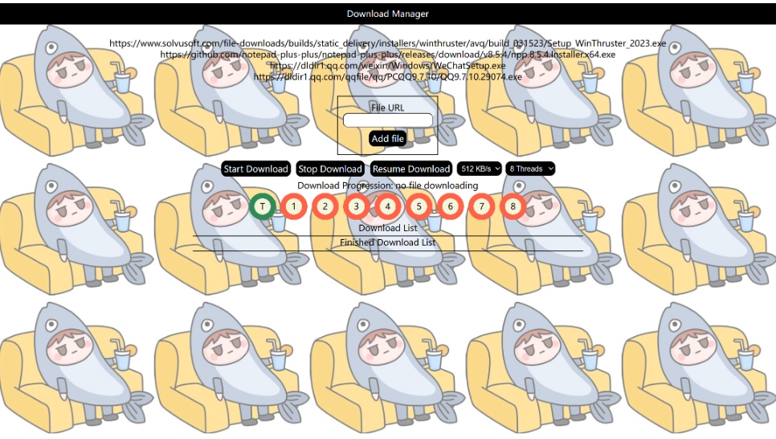
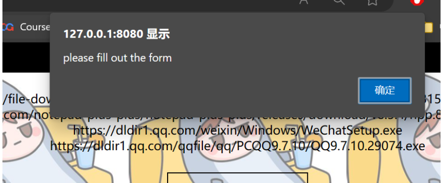
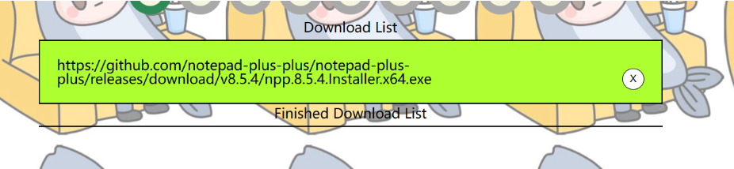
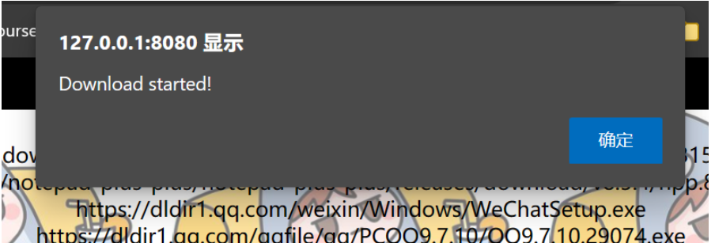
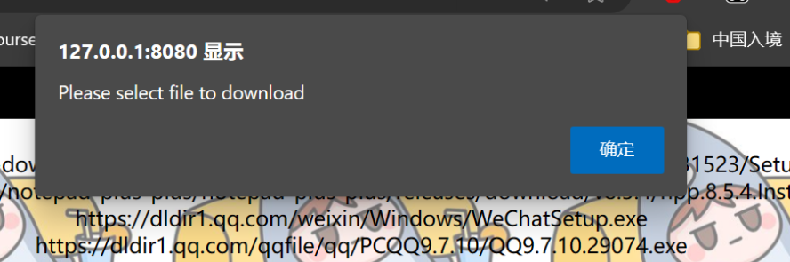
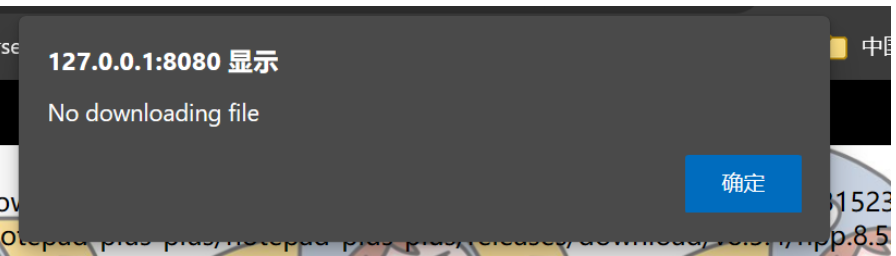
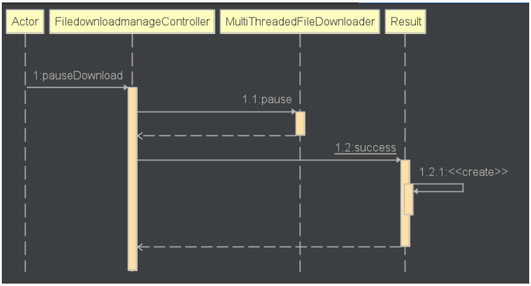

# Each Module Time Spent

| PSP                                     | Personal Software Process Stages        | 预估耗时（分钟） | 实际耗时（分钟） |
| --------------------------------------- | --------------------------------------- | ---------------- | ---------------- |
| Planning                                | 计划                                    | 60               | 50               |
| · Estimate                              | · 估计这个任务需要多少时间              | 1440             | 1080             |
| Development                             | 开发                                    | 1080             |                  |
| · Analysis                              | · 需求分析 (包括学习新技术)             | 360              | 360              |
| · Design Spec                           | · 生成设计文档                          | 60               | 60               |
| · Design Review                         | · 设计复审 (和同事审核设计文档)         | 60               | 60               |
| · Coding Standard                       | · 代码规范 (为目前的开发制定合适的规范) | 60               | 60               |
| · Design                                | · 具体设计                              | 120              | 100              |
| · Coding                                | · 具体编码                              | 1440             | 1440              |
| · Code Review                           | · 代码复审                              | 60               | 60               |
| · Test                                  | · 测试（自我测试，修改代码，提交修改）  | 360              | 360              |
| Reporting                               | 报告                                    | 360              | 360              |
| · Test Report                           | · 测试报告                              | 180              | 180              |
| · Size Measurement                      | · 计算工作量                            | 90               | 120              |
| · Postmortem & Process Improvement Plan | · 事后总结, 并提出过程改进计划          | 90               | 60               |
|                                         | 合计                                    | 3300             | 3310             |

# Ideas for solving the problem
1. Second Iteration Requirement
	1. Download list function: pause, resume, cancel
	2. Add multiple URL
	3. Resume download from previous pause
	4. Accept different protocol: FTP, SFTP, P2P
2. 1st，after researching, can use synchronized and wait to complete this funciton
3. 2nd，use database to save the download list
4. 3rd，same as 1st function
5. 4th, not implemented

# Design implementation process
## Database Design
1.  fileDownloadManage

| 属性            | 类型       |
| --------------- | ---------- |
| fileId          | FK         |
| fileDownloaded  | yes/no     |
| fileDownloading | yes/no     |
| downloadedByte  | Double     |
| fileUrl         | String     |
| fileSelected    | true/false |

## Frontend Design

1. templates
	1. index.html
2. css
	1. global.css
	2. index.css
3. js
	1. utils
		1. file.js
		2. progress.js
		3. update.js
	2. index.js


Overall design


1. Add url
	1. success
	2. failed![Alt text]
2. Url select
3. Download file
	1. success
    
	2. failed
4. Stop Download
	1. success
	2. failed
5. Alter thread count

## Class Design
Added pause and resume function to `MultiThreadedFileDownloader.java`, other than that also added addDownloadTask function，used to save list of file that need to be downloaded.


## addDownload sequential diagram


## pauseDownload sequential diagram


## resumeDownload sequential diagram


# JProfiler


# Code Explanation
Code belows are mostly improve user experience

## fileService
```java
public Map<String, Object> addFile(String url) throws MalformedURLException;  //添加文件到数据库的file table

public File hasFile(String url);  //检查数据库是否有该文件

public List<File> allFile();  //获取数据库内的所有文件

public boolean deleteFile(String url); //删除数据库内的特定文件

```

```java
public File hasFile(String url) {  
    String fileUrl = url;  
    File file = this.baseMapper.findFileByURL(fileUrl);  
  
    if(file != null){  
        return file;  
    }  
  
    return null;  
}
```

## FiledownloadmanageService
```java
public Filedownloadmanage get(String fileUrl);  //获取文件下载信息

public Boolean addFile(Integer fileId, String fileUrl);  //添加文件到fdm table

public void deleteFile(String fileUrl);  //删除 fdm table里的文件

public Boolean select(String fileUrl, String selected);   //选择fdm

public List<Filedownloadmanage> getSelectedFileList();  //获取被选中的文件
  
public Double getDownloadedByte(String fileUrl);  

public File getFile(String fileUrl);  //从table file获取文件

public Filedownloadmanage setDownloading(String fileUrl); //设置特定fdm为downloading

public Filedownloadmanage setDownloadingNo(String fileUrl);  //设置特定fdm不为downloading

public Filedownloadmanage setDownloaded(String fileUrl);  //设置他已经下载

public List<Filedownloadmanage> getAllDownloadedFile(); //获取所有已下载的文件

```

```java
public Boolean addFile(Integer fileId, String fileUrl) {  
    Filedownloadmanage filedownloadmanage = new Filedownloadmanage(fileId,fileUrl,"no","no",0,"false");  
    System.out.println("added to filedownloadmanage" + filedownloadmanage.toString());  
    this.baseMapper.addFile(filedownloadmanage);  
  
    return true;}
```

## index.js
Take care of `Events`，the logical code are in `file.js`, `progress.js`, `update.js` 
```js
window.onload = function(){  
    loadDownloadFileList()  
    loadDownloadedFileList()  
  
    setInterval(updateFunc,100)  
  
    //默认8线程  
    addProgressCircle(8)  
  
    // get speed value  
    $("#downloadspeedselector").change(function(){  
        speedLimit = $(this).val();  
        console.log($(this).val())  
    })  
  
    // thread value  
    $("#threadselector").change(function () {  
        threadCount = $(this).val()  
        addProgressCircle($(this).val())  
    })  
  
    // add file to list  
    $("#addFile").click(function(){  
        addToList();  
    })  
  
    //list item select  
    toDownloadList.addEventListener("click",function(e){  
        fileSelected(e);  
    })  
  
    //list item delete select  
    toDownloadList.addEventListener("click", function (e){  
        deleteFromList(e);  
    })  
  
    //download button click  
    //download file that are selected    downloadBtn.addEventListener("click", function(){  
        downloadFile();  
    })  
  
    //stop button click, pause download  
    stopBtn.addEventListener("click", function(){  
        stopDownload();  
    })  
  
    //resume button click  
    resumeBtn.addEventListener("click", function(){  
        resumeDownload();  
    })  
  
}
```

## file.js
functions()：addToList, loadDownloadFileList, deleteFromList, downloadFile, fileSelected, stopDownload, resumeDownload, loadDownloadedFileList
[FourthIteration](../Phase4/FourthIteration.md)

```js
export function addToList(){  
    var newFile = document.getElementById("newFile").value;  
  
    if(newFile === ""){  
        alert("please fill out the form");  
        return false;    }  
  
    if(isValidURL(newFile)){  
        //检查文件是否存在于数据库  
        $.ajax({  
            url: localURL + "/file/hasFile/" + "?url=" + newFile,  
            method: "GET",  
            success: function(data){  
                var returnCode = data.code;  
                console.log(data)  
                //若存在
                if(returnCode === 20000){  
                    alert(data.message);  
                    // clear  
                    newFile = document.getElementById("newFile").value = "";  
                    return false;                }else{  
                    // create new element  
                    var newItem = document.createElement("li");  
                    var text = document.createTextNode(newFile);  
                    var deleteFileBtn = document.createElement("BUTTON");  
  
                    deleteFileBtn.setAttribute('class','deleteTask');  
                    deleteFileBtn.innerHTML = "X";  
  
                    newItem.appendChild(text);  
                    newItem.appendChild(deleteFileBtn);  

					//对数据库进行更改
                    $.ajax({  
                        url: localURL + "/file/add/"+"?url="+newFile,  
                        method: 'GET',  
                        success: function(data){  
                            console.log(data);  
                        },  
                        error: function(jqXHR, textStatus, errorThrown){  
                            console.error("Error:",  errorThrown);  
                        }  
                    });  

					//添加任务到前端展示
                    toDownloadList.appendChild(newItem);  
  
                    // clear  
                    newFile = document.getElementById("newFile").value = "";  
                }  
            },  
            error: function(jqXHR, textStatus, errorThrown){  
                console.error("Error:",  errorThrown);  
            }  
        });  
  
    }else{  
        newFile = document.getElementById("newFile").value = "";  
        alert("invalid URL");  
        return false;    }  
  
}
```

## progress.js
Used to change the view of circle radial displayed on front end
```js
export function addProgressCircle(count){  
  
    var threadCount = count;  
  
    // clear previous nodes  
    $("#progress-area").empty();  
  
    //create main progress  
    var div = document.createElement("div");  
  
    div.innerHTML =  
        '<div class="progress-radial progress-radial-main" id="progress-main">\n'+  
        '    <div class="overlay">T</div>\n'+  
        '</div>\n'  
  
  
    //create threads progress  
    for(var i =1; i<=threadCount;i++){  
        div.innerHTML = div.innerHTML +  
            '<div class="progress-radial" id="progress-' + i +'">\n' +  
            '    <div class="overlay">'+ i +'</div>\n' +  
            '</div>\n'  
  
    }  
  
    progressarea.appendChild(div);  
}
```

## update.js
Update the speeds, the current download file, and the progress
```js
export function updateFunc(){  
    //1.get current downloading file name, update on current downloading  
    $.ajax({  
        url: localURL + "/filedownloadmanage/getCurrentDownloading",  
        method: "GET",  
        success: function(data){  
            if(data.code === 20001){  
                currentDownloadText.innerText = "no file downloading"  
            }else{  
                currentDownloadText.innerText = data.data  
            }  
  
        },  
        error: function(jqXHR, textStatus, errorThrown){  
            console.error("Error:",  errorThrown);  
        }  
    })  
  
    //2. get thread download process  
    $.ajax({  
        url: localURL + "/filedownloadmanage/getThreadProcess",  
        method: "GET",  
        success: function(data){  
            if(data.code === 20001){  
                return  
            }  
            else{  
                for(let i = 0; i < data.data.length;i++){  
                    //更新图片，删除原有的class，增加class  
                    let name = "#progress-" + (i+1)  
                    $(name).removeClass();  
                    $(name).addClass("progress-radial")  
                    $(name).addClass("progress-"+ (data.data[i]*10))  
                }  
            }  
  
        },  
        error: function(jqXHR, textStatus, errorThrown){  
            console.error("Error:",  errorThrown);  
        }  
  
    })  
  
}
```

# Conclusion
This iteration involved a substantial amount of work for me, as I dedicated a significant amount of time to handling the integration between the front-end and back-end. I also learned about the importance of using interface documentation, which greatly assisted me in the development process. There are still tasks pending completion in this iteration, including those related to other protocols. In the upcoming iterations, I plan to further enhance this particular functionality.

Moreover, while working with my custom downloader, I observed that its download speed is much faster than the built-in downloader in Chrome. This discovery has motivated me to invest more effort in refining and improving this multi-threaded downloader.

Although the design of the front-end was not explicitly required, I believe that my approach adds significant value to future development efforts.