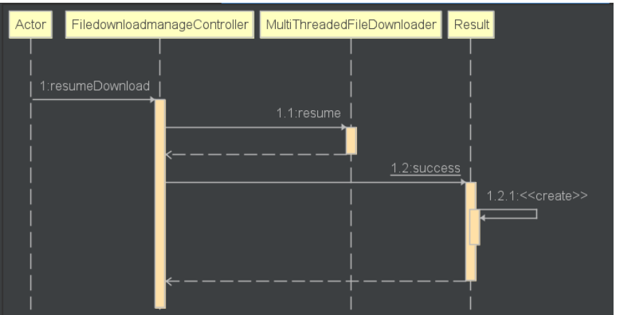

# 各个模块的预期耗时和实际耗时

| PSP                                     | Personal Software Process Stages        | 预估耗时（分钟） | 实际耗时（分钟） |
| --------------------------------------- | --------------------------------------- | ---------------- | ---------------- |
| Planning                                | 计划                                    | 60               | 50               |
| · Estimate                              | · 估计这个任务需要多少时间              | 1440             | 1080             |
| Development                             | 开发                                    | 1080             |                  |
| · Analysis                              | · 需求分析 (包括学习新技术)             | 360              | 360              |
| · Design Spec                           | · 生成设计文档                          | 60               | 60               |
| · Design Review                         | · 设计复审 (和同事审核设计文档)         | 60               | 60               |
| · Coding Standard                       | · 代码规范 (为目前的开发制定合适的规范) | 60               | 60               |
| · Design                                | · 具体设计                              | 120              | 100              |
| · Coding                                | · 具体编码                              | 1440             | 1440              |
| · Code Review                           | · 代码复审                              | 60               | 60               |
| · Test                                  | · 测试（自我测试，修改代码，提交修改）  | 360              | 360              |
| Reporting                               | 报告                                    | 360              | 360              |
| · Test Report                           | · 测试报告                              | 180              | 180              |
| · Size Measurement                      | · 计算工作量                            | 90               | 120              |
| · Postmortem & Process Improvement Plan | · 事后总结, 并提出过程改进计划          | 90               | 60               |
|                                         | 合计                                    | 3300             | 3310             |

# 解题思路
1. 通过阅读第二次迭代的要求，发现主要的功能有以下几点
	1. 下载任务管理功能：支持下载队列、暂停、恢复、取消等操作
	2. 支持批量加入下载地址功能
	3. 支持断点续传功能
	4. 支持多协议：除 http/https 外，也能够支持如 FTP、SFTP、P2P、磁力链等（未实现）
2. 第一点，支持任务的暂停、恢复操作，这一点通过了解java线程的的synchronized,wait等具体实现出想要的功能。
3. 第二点，支持批量加入下载地址功能，设计出一个数据库记录要下载的文件，下载的时候批量读入要下载的文件加入一个队列并调用第一阶段的download函数
4. 第三点，支持断点续传功能，同第一点，需要理解java线程的synchronized和wait
5. 最后一点，尚未实现

由于在上一次使用Python设计按钮进行下载停止以及继续功能出现了一些问题，例如文件在下载的时候不能够点击其他按钮操作，因为我的程序只有一个线程。吸取教训后这次使用了java web它提供了多线程，所以操作不会影响。

# 设计实现过程
## 数据库设计
续上一个迭代后我再次设计了一个数据类用来保存需要下载的文件。
1.  文件下载管理器 fileDownloadManage
	其中fileSelected用来确定该文件是否本次进行下载，若为true则进行下载。

| 属性            | 类型         |
| --------------- | ------------ |
| fileId          | 外键         |
| fileDownloaded  | yes/no       |
| fileDownloading | yes/no       |
| downloadedByte  | Double       |
| fileUrl         | 字符串String |
| fileSelected    | true/false   |

## 前端设计

1. templates
	1. index.html
2. css
	1. global.css
	2. index.css
3. js
	1. utils
		1. file.js
		2. progress.js
		3. update.js
	2. index.js

其中index.html包含了网页前端的体现
index.js包含了主要前端的核心功能例如：请求服务信息，展现视图给用户，提示用户操作等等
file.js, progress.js和update.js分别对index.js原有的功能模块化，使得代码更容易阅读理解。

整体设计


部分功能的展示
1. 文件添加
	1. 添加成功
	2. 添加失败![Alt text]
2. 文件选择
3. 文件下载
	1. 下载成功
    
	2. 下载失败
4. 文件停止
	1. 停止成功
	2. 停止失败
5. 更换线程数目

## 类的设计
由于本次的核心未停止以及继续，还有批量下载文件，我在第一次迭代的MultiThreadedFileDownloader的基础上新增了pause和resume功能，除此之外，也添加了addDownloadTask功能，用以添加下载到当前需要下载的队列，并且调用startDownload开始批量下载文件。


## addDownload的顺序图


## pauseDownload的顺序图


## resumeDownload的顺序图


# 使用Jprofiler进行性能监控
各个类对内存消耗如下：


# 新增代码说明
以下功能主要用来返回有用信息给前端，用以更新界面让用户使用体验增加。

## fileService
```java
public Map<String, Object> addFile(String url) throws MalformedURLException;  //添加文件到数据库的file table

public File hasFile(String url);  //检查数据库是否有该文件

public List<File> allFile();  //获取数据库内的所有文件

public boolean deleteFile(String url); //删除数据库内的特定文件

```

hasFile具体代码，调用baseMapper查找数据库并得到想要的值。对于其他的方法雷同。
```java
public File hasFile(String url) {  
    String fileUrl = url;  
    File file = this.baseMapper.findFileByURL(fileUrl);  
  
    if(file != null){  
        return file;  
    }  
  
    return null;  
}
```

## FiledownloadmanageService
```java
public Filedownloadmanage get(String fileUrl);  //获取文件下载信息

public Boolean addFile(Integer fileId, String fileUrl);  //添加文件到fdm table

public void deleteFile(String fileUrl);  //删除 fdm table里的文件

public Boolean select(String fileUrl, String selected);   //选择fdm

public List<Filedownloadmanage> getSelectedFileList();  //获取被选中的文件
  
public Double getDownloadedByte(String fileUrl);  

public File getFile(String fileUrl);  //从table file获取文件

public Filedownloadmanage setDownloading(String fileUrl); //设置特定fdm为downloading

public Filedownloadmanage setDownloadingNo(String fileUrl);  //设置特定fdm不为downloading

public Filedownloadmanage setDownloaded(String fileUrl);  //设置他已经下载

public List<Filedownloadmanage> getAllDownloadedFile(); //获取所有已下载的文件

```

addFile的具体代码，也是调用baseMapper，其他的方法雷同。
```java
public Boolean addFile(Integer fileId, String fileUrl) {  
    Filedownloadmanage filedownloadmanage = new Filedownloadmanage(fileId,fileUrl,"no","no",0,"false");  
    System.out.println("added to filedownloadmanage" + filedownloadmanage.toString());  
    this.baseMapper.addFile(filedownloadmanage);  
  
    return true;}
```

## index.js
主要处理点击事件并执行相应的操作，分别在file, progress, update.js文件内
```js
window.onload = function(){  
    loadDownloadFileList()  
    loadDownloadedFileList()  
  
    setInterval(updateFunc,100)  
  
    //默认8线程  
    addProgressCircle(8)  
  
    // get speed value  
    $("#downloadspeedselector").change(function(){  
        speedLimit = $(this).val();  
        console.log($(this).val())  
    })  
  
    // thread value  
    $("#threadselector").change(function () {  
        threadCount = $(this).val()  
        addProgressCircle($(this).val())  
    })  
  
    // add file to list  
    $("#addFile").click(function(){  
        addToList();  
    })  
  
    //list item select  
    toDownloadList.addEventListener("click",function(e){  
        fileSelected(e);  
    })  
  
    //list item delete select  
    toDownloadList.addEventListener("click", function (e){  
        deleteFromList(e);  
    })  
  
    //download button click  
    //download file that are selected    downloadBtn.addEventListener("click", function(){  
        downloadFile();  
    })  
  
    //stop button click, pause download  
    stopBtn.addEventListener("click", function(){  
        stopDownload();  
    })  
  
    //resume button click  
    resumeBtn.addEventListener("click", function(){  
        resumeDownload();  
    })  
  
}
```

## file.js
包含的功能有：addToList, loadDownloadFileList, deleteFromList, downloadFile, fileSelected, stopDownload, resumeDownload, loadDownloadedFileList
更多的代码可以查看程序里。
调用相关的接口可以看接口文档
[第四阶段迭代报告](../Phase4/第四阶段迭代报告.md)

```js
export function addToList(){  
    var newFile = document.getElementById("newFile").value;  
  
    if(newFile === ""){  
        alert("please fill out the form");  
        return false;    }  
  
    if(isValidURL(newFile)){  
        //检查文件是否存在于数据库  
        $.ajax({  
            url: localURL + "/file/hasFile/" + "?url=" + newFile,  
            method: "GET",  
            success: function(data){  
                var returnCode = data.code;  
                console.log(data)  
                //若存在
                if(returnCode === 20000){  
                    alert(data.message);  
                    // clear  
                    newFile = document.getElementById("newFile").value = "";  
                    return false;                }else{  
                    // create new element  
                    var newItem = document.createElement("li");  
                    var text = document.createTextNode(newFile);  
                    var deleteFileBtn = document.createElement("BUTTON");  
  
                    deleteFileBtn.setAttribute('class','deleteTask');  
                    deleteFileBtn.innerHTML = "X";  
  
                    newItem.appendChild(text);  
                    newItem.appendChild(deleteFileBtn);  

					//对数据库进行更改
                    $.ajax({  
                        url: localURL + "/file/add/"+"?url="+newFile,  
                        method: 'GET',  
                        success: function(data){  
                            console.log(data);  
                        },  
                        error: function(jqXHR, textStatus, errorThrown){  
                            console.error("Error:",  errorThrown);  
                        }  
                    });  

					//添加任务到前端展示
                    toDownloadList.appendChild(newItem);  
  
                    // clear  
                    newFile = document.getElementById("newFile").value = "";  
                }  
            },  
            error: function(jqXHR, textStatus, errorThrown){  
                console.error("Error:",  errorThrown);  
            }  
        });  
  
    }else{  
        newFile = document.getElementById("newFile").value = "";  
        alert("invalid URL");  
        return false;    }  
  
}
```

## progress.js
该模块根据线程数目的改变更改页面展示的进度圈数量
```js
export function addProgressCircle(count){  
  
    var threadCount = count;  
  
    // clear previous nodes  
    $("#progress-area").empty();  
  
    //create main progress  
    var div = document.createElement("div");  
  
    div.innerHTML =  
        '<div class="progress-radial progress-radial-main" id="progress-main">\n'+  
        '    <div class="overlay">T</div>\n'+  
        '</div>\n'  
  
  
    //create threads progress  
    for(var i =1; i<=threadCount;i++){  
        div.innerHTML = div.innerHTML +  
            '<div class="progress-radial" id="progress-' + i +'">\n' +  
            '    <div class="overlay">'+ i +'</div>\n' +  
            '</div>\n'  
  
    }  
  
    progressarea.appendChild(div);  
}
```

## update.js
该模块用来定时更新前端的信息，主要更新进度条
```js
export function updateFunc(){  
    //1.get current downloading file name, update on current downloading  
    $.ajax({  
        url: localURL + "/filedownloadmanage/getCurrentDownloading",  
        method: "GET",  
        success: function(data){  
            if(data.code === 20001){  
                currentDownloadText.innerText = "no file downloading"  
            }else{  
                currentDownloadText.innerText = data.data  
            }  
  
        },  
        error: function(jqXHR, textStatus, errorThrown){  
            console.error("Error:",  errorThrown);  
        }  
    })  
  
    //2. get thread download process  
    $.ajax({  
        url: localURL + "/filedownloadmanage/getThreadProcess",  
        method: "GET",  
        success: function(data){  
            if(data.code === 20001){  
                return  
            }  
            else{  
                for(let i = 0; i < data.data.length;i++){  
                    //更新图片，删除原有的class，增加class  
                    let name = "#progress-" + (i+1)  
                    $(name).removeClass();  
                    $(name).addClass("progress-radial")  
                    $(name).addClass("progress-"+ (data.data[i]*10))  
                }  
            }  
  
        },  
        error: function(jqXHR, textStatus, errorThrown){  
            console.error("Error:",  errorThrown);  
        }  
  
    })  
  
}
```

# 总结于反思
本次迭代的任务量比较多，我花了很多时间处理前后端对接，并且也学习到了接口文档的重要性，他在我的开发过程中起到了很大的帮助，本次迭代的任务尚未完成的有包含其他的协议。之后的迭代里我会继续完善这一个功能，并且我在使用自己的下载器时发现他的下载速度比chrome内置的下载器快许多，这让我更有兴致的去好好完善这一个多线程下载器。
虽然前端的设计不被要求，但是我相信我这个做法对未来的开发是非常有价值的。