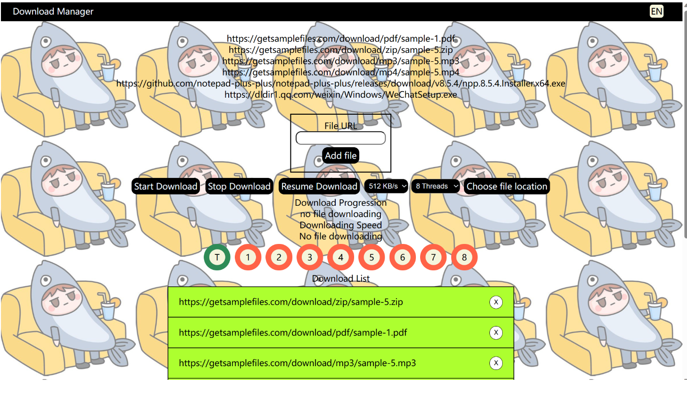

# Each Module Time Spent

| PSP                                     | Personal Software Process Stages        | 预估耗时（分钟） | 实际耗时（分钟） |
| --------------------------------------- | --------------------------------------- | ---------------- | ---------------- |
| Planning                                | 计划                                    | 60               | 50               |
| · Estimate                              | · 估计这个任务需要多少时间              | 1440             | 1080             |
| Development                             | 开发                                    | 1080             |                  |
| · Analysis                              | · 需求分析 (包括学习新技术)             | 360              | 360              |
| · Design Spec                           | · 生成设计文档                          | 60               | 60               |
| · Design Review                         | · 设计复审 (和同事审核设计文档)         | 60               | 60               |
| · Coding Standard                       | · 代码规范 (为目前的开发制定合适的规范) | 60               | 60               |
| · Design                                | · 具体设计                              | 120              | 100              |
| · Coding                                | · 具体编码                              | 480              | 480              |
| · Code Review                           | · 代码复审                              | 60               | 60               |
| · Test                                  | · 测试（自我测试，修改代码，提交修改）  | 360              | 360              |
| Reporting                               | 报告                                    | 360              | 360              |
| · Test Report                           | · 测试报告                              | 180              | 180              |
| · Size Measurement                      | · 计算工作量                            | 90               | 120              |
| · Postmortem & Process Improvement Plan | · 事后总结, 并提出过程改进计划          | 90               | 60               |
|                                         | 合计                                    | 2340             | 2350                 |

# Ideas for solving the problem
1. Requirements
	1. Download speed limits and bandwidth allocation features
	2. Supports automatic classification and archiving of download tasks
		1. Download the file to the appropriate folder according to the type of file
		2. pdf, zip, exe, mpeg, gif, jpeg, png etc
		3. for example pdf file：C:/Users/User/downloads/pdf/[filename].pdf
	3. Implement the automatic decompression and installation function of the download task
		1. Searched how to unzip file in java through web
	4. Multi-language support
		1. Implement using json key value

# Design implementation process
## Frontend Design


added `language.js` and `index.json` to support multi-language support

English


Chinese


## unzip file sequential diagram


After zip file are downloaded，will operate fileUtils to unzip file

# JProfiler


# Code Explanation
## automatic classification and archiving of download tasks
```java
String home = System.getProperty("user.home");  
  
for (Filedownloadmanage f: fileList  
     ) {  
    File newFile = iFiledownloadmanageService.getFile(f.getFileUrl());  
    fileInfoList.add(newFile);  
  
    //创建文件夹for对应的文件类型 10/7/2023 文件归档  
    String filePath = home + "\\Downloads\\" + newFile.getFileType();  
    fileUtils.createFileDirectory(filePath);  
  
}
```

```java
public boolean createFileDirectory(String filePath) {  
    File directory = new File(filePath);  
  
    return directory.mkdirs();  
}
```

After download button pressed, will track the file type, then create folder in corresponding location

## unzip file
```java
String zipFilePath = "C:\\Users\\tvh10\\Downloads\\zip\\sample-5.zip";  
String destinationFolder = "C:\\Users\\tvh10\\Downloads\\zip\\unzip";  
  
try (ZipInputStream zis = new ZipInputStream(new FileInputStream(zipFilePath))) {  
    ZipEntry entry;  
  
    while ((entry = zis.getNextEntry()) != null) {  
        String entryName = entry.getName();  
        File entryFile = new File(destinationFolder, entryName);  
  
        if (entry.isDirectory()) {  
            // Create directory if it doesn't exist  
            entryFile.mkdirs();  
        } else {  
            // Create parent directories if they don't exist  
            entryFile.getParentFile().mkdirs();  
  
            // Extract the file  
            try (OutputStream os = new FileOutputStream(entryFile)) {  
                byte[] buffer = new byte[1024];  
                int length;  
                while ((length = zis.read(buffer)) > 0) {  
                    os.write(buffer, 0, length);  
                }  
            }  
        }  
  
        zis.closeEntry();  
    }  
  
    System.out.println("Zip file extracted successfully.");  
} catch (IOException e) {  
    e.printStackTrace();  
}
```

After all file downloaded, will track the downloaded list with file type of zip, then unzip it

## Multi-language support
```js
export function changeLanguage(){  
    if(langBtn.innerHTML === "CN"){  
        langBtn.innerHTML = "EN"  
        loadPageLanguage(languageUrl,"en")  
    }else{  
        langBtn.innerHTML = "CN"  
        loadPageLanguage(languageUrl,"cn")  
  
    }  
}  
  
function loadPageLanguage(languageUrl, language){  
    $.getJSON(languageUrl, function(data){  
        let languageObj = data[language][0];  
  
        $("#headerTitle").text(languageObj.title);  
        $("#box-title").text(languageObj.box_title);  
        $("#addFile").text(languageObj.add_file_btn);  
        $("#btn-download").text(languageObj.start_download_btn);  
        $("#btn-stop").text(languageObj.stop_download_btn);  
        $("#btn-resume").text(languageObj.resume_download_btn);  
        $("#btn-choose-file").text(languageObj.file_location);  
        $("#download-progress-text").text(languageObj.download_progress);  
        $("#download-speed-text").text(languageObj.download_speed);  
        $("#download-list").text(languageObj.download_list);  
        $("#fin-download-list").text(languageObj.fin_download_list);  
        });  
}
```

```json
{  
  "cn" : [{  
    "title" : "下载管理器",  
    "box_title": "文件URL",  
    "add_file_btn" : "添加文件",  
    "start_download_btn": "开始下载",  
    "stop_download_btn": "停止下载",  
    "resume_download_btn": "继续下载",  
    "file_location": "选择文件路径",  
    "download_progress": "下载进度",  
    "download_speed": "下载速度",  
    "download_list": "下载列表",  
    "fin_download_list": "完成下载列表"  
  }],  
  "en" : [{  
    "title" : "Download Manager",  
    "box_title": "File URL",  
    "add_file_btn" : "Add file",  
    "start_download_btn": "Start Download",  
    "stop_download_btn": "Stop Download",  
    "resume_download_btn": "Resume Download",  
    "file_location": "Choose file location",  
    "download_progress": "Download Progression",  
    "download_speed": "Downloading Speed",  
    "download_list": "Download List",  
    "fin_download_list": "Finished Download List"  
  }]  
}
```

# Conclusion
The newly added features in this iteration posed some challenges, especially the aspect of speed limitation, which took me nearly 2 hours without completion. Therefore, I focused on implementing the functionalities for tasks 2, 3, and 4 first. The automatic archiving of files didn't present significant issues because I had designed the database in the first iteration and stored file types, making the archiving process straightforward. 

Next was the third feature - extracting zip files. For the extraction process, I researched relevant information online, and the principle involves reading the content and writing it to a new file. In this regard, I utilized Java packages to help with the implementation.

Regarding the last functionality, language switching, I leveraged my previous experience and used frontend JavaScript to facilitate the switch between Chinese and English languages.

In summary, this iteration went relatively smoothly due to the prior database design and the ability to learn and apply necessary technologies. However, a key takeaway for me is the importance of careful database design before development to avoid unnecessary database operations. Additionally, continuous learning of design patterns is crucial to maintaining clean and organized code.