# Each Module Time Spent

| PSP                                     | Personal Software Process Stages        | 预估耗时（分钟） | 实际耗时（分钟） |
| --------------------------------------- | --------------------------------------- | ---------------- | ---------------- |
| Planning                                | 计划                                    | 20               | 20               |
| · Estimate                              | · 估计这个任务需要多少时间              | 900             | 800             |
| Development                             | 开发                                    | 1080             |                  |
| · Analysis                              | · 需求分析 (包括学习新技术)             | 120              | 120              |
| · Design Spec                           | · 生成设计文档                          | 30               | 30               |
| · Design Review                         | · 设计复审 (和同事审核设计文档)         | 20               | 20               |
| · Coding Standard                       | · 代码规范 (为目前的开发制定合适的规范) | 20               | 20               |
| · Design                                | · 具体设计                              | 60              | 60              |
| · Coding                                | · 具体编码                              | 60              | 60              |
| · Code Review                           | · 代码复审                              | 30               | 30               |
| · Test                                  | · 测试（自我测试，修改代码，提交修改）  | 120              | 120              |
| Reporting                               | 报告                                    | 120              | 120              |
| · Test Report                           | · 测试报告                              | 120              | 120              |
| · Size Measurement                      | · 计算工作量                            | 90               | 120              |
| · Postmortem & Process Improvement Plan | · 事后总结, 并提出过程改进计划          | 90               | 60               |
|                                         | 合计                                    | 1000             | 970                 |

# Ideas for solving the problem
1. Requirement: Make a Visual interface for user and reconduct functional analysis and modeling of the user requirements of the application
	1. Clearly design the input and output relationships of each function
2. 软件设计需要进行扩充，加入用户交互界面设计和界面模块的设计
	1. 交互界面设计主要基于网页进行设计，并且以简单为主。

# Design implementation process
## Front-end and back-end interface design
### File Controller

| name       | URL                                       | method | input | output           | functionality                 |
| ---------- | ----------------------------------------- | ------ | ----- | ---------------- | ----------------------------- |
| addFile    | http://127.0.0.1:8080/api/file/add        | GET    | url   | Result           | use IFileService addFile()    |
| haveFile   | http://127.0.0.1:8080/api/file/hasFile    | GET    | url   | Result File      | use IFileService hasFile()    |
| AllFile    | http://127.0.0.1:8080/api/file/allFile    | GET    | none  | Result List File | use IFileService allFile()    |
| deleteFile | http://127.0.0.1:8080/api/file/deleteFile | GET    | url   | Result File      | use IFileService deleteFile() |

### Filedownloadmanage Controller

| name                  | URL                                                                | method | input          | output                                  | functionality                                                                    |
| --------------------- | ------------------------------------------------------------------ | ---- | ------------- | ------------------------------------- | ----------------------------------------------------------------------- |
| selectFile            | http://127.0.0.1:8080/api/filedownloadmanage/select                | POST | url，hasClass | Result Filedownloadmanage             | 调用IFiledownloadmanageService的select()                                |
| downloadFile          | http://127.0.0.1:8080/api/filedownloadmanage/download              | POST | thread, speed | Result List Filedownloadmanage        | 前端传送thread, speed给后端并开始下载，调用getSelectedFileList和getFileUrl然后对他们进行setDownloading，startDownload然后setDownloaded，setDownloadingNo最后findZipAndDownload解压                                   |
| pauseDownload         | http://127.0.0.1:8080/api/filedownloadmanage/pauseDownload         | GET  | none          | Result File                           | 调用MultiThreadedFileDownloader的pause()                                |
| resumeDownload        | http://127.0.0.1:8080/api/filedownloadmanage/resumeDownload        | GET  | none          | Result File                           | 调用MultiThreadedFileDownloader的resume()                               |
| getCurrentDownloading | http://127.0.0.1:8080/api/filedownloadmanage/getCurrentDownloading | GET  | none          | String(file url)/ current no download | 调用MultiThreadedFileDownloader的getCurrentDownload()                   |
| getDownloadedFile     | http://127.0.0.1:8080/api/filedownloadmanage/getDownloadedFile     | GET  | none          | Result List File                      | 调用IFiledownloadmanageService的getAllDownloadFile()，然后调用getFile() |
| getThreadProcess      | http://127.0.0.1:8080/api/filedownloadmanage/getThreadProcess      | GET  | none          | Result List Long                      | 调用MultiThreadedFileDownloader的getThreadProcess()                                             |
| getDownloadSpeed      | http://127.0.0.1:8080/api/filedownloadmanage/getDownloadSpeed      | GET  | none          | Double                                | 调用MultiThreadedFileDownloader的getThreadDownloadSpeed()                                                          |

## Functional interface design
### IFileService

| interface name | input | output              | functionality                 |
| -------------- | ----- | ------------------- | ----------------------------- |
| addFile        | url   | Map(String, Object) | add file into file table      |
| hasFile        | url   | File                | check file returns file       |
| allFile        | none  | List File           | return all file in file table |
| deleteFile     | url   | boolean             | delete file                   |
|                |       |                     |                               |

### IFiledownloadmanageService

| interface name             | input          | output                    | functionality                              |
| -------------------- | ------------- | ----------------------- | --------------------------------- |
| get                  | url           | Filedownloadmanage      | get from filedownloadmanage       |
| addFile              | fileId, url   | Boolean                 | add file to filedownloadmanage    |
| select               | url, selected | Boolean                 | select specific file              |
| getSelectedFileList  | none          | List Filedownloadmanage | get from filedownloadmanage       |
| getFile              | url           | File                    | get file                          |
| setDownloading       | url           | Filedownloadmanage      | change state to downloading       |
| setDownloadingNo     | url           | Filedownloadmanage      | change state to not downloading   |
| setDownloaded        | url           | Filedownloadmanage      | change state to downloaded        |
| getAllDownloadedFile | 无            | List Filedownloadmanage | get downloaded list               |
| findZipAndDownloaded | 无            | List File               | get zip file list |

## Functional sequential diagram
### addFile
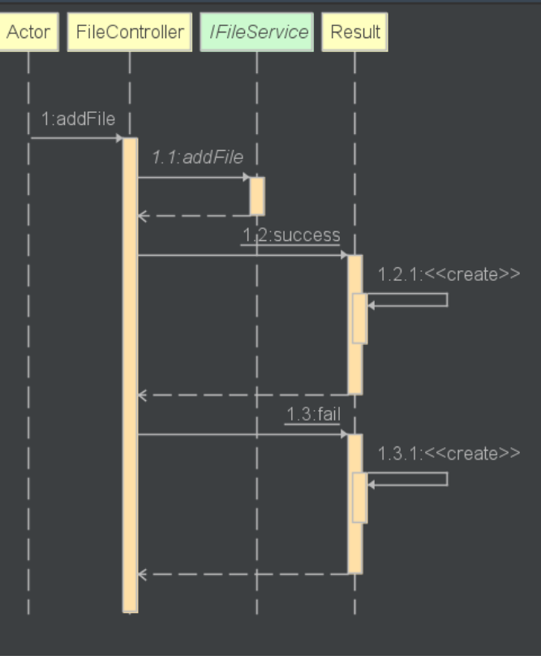

### downloadFile
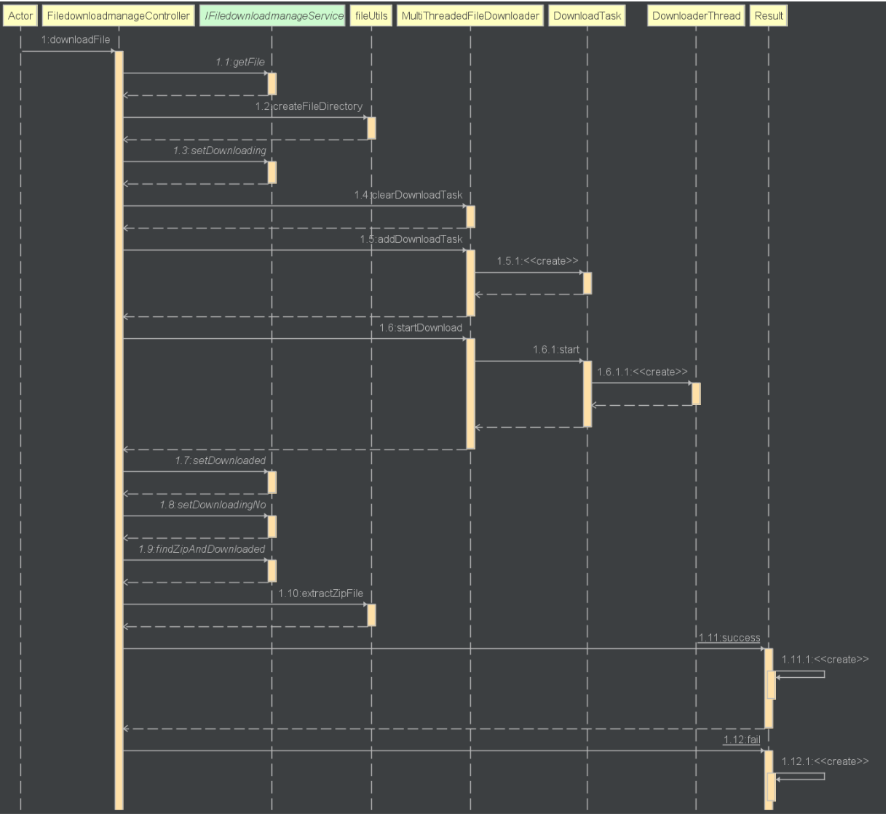

### pauseDownload
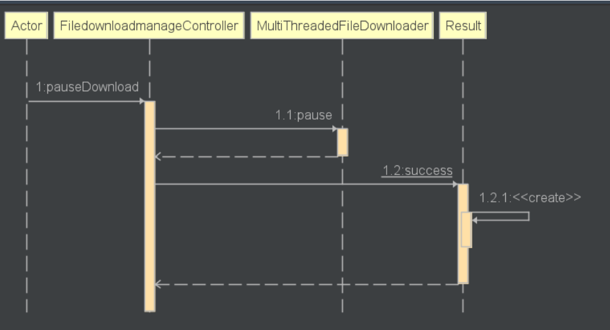

### resumeDownlaod
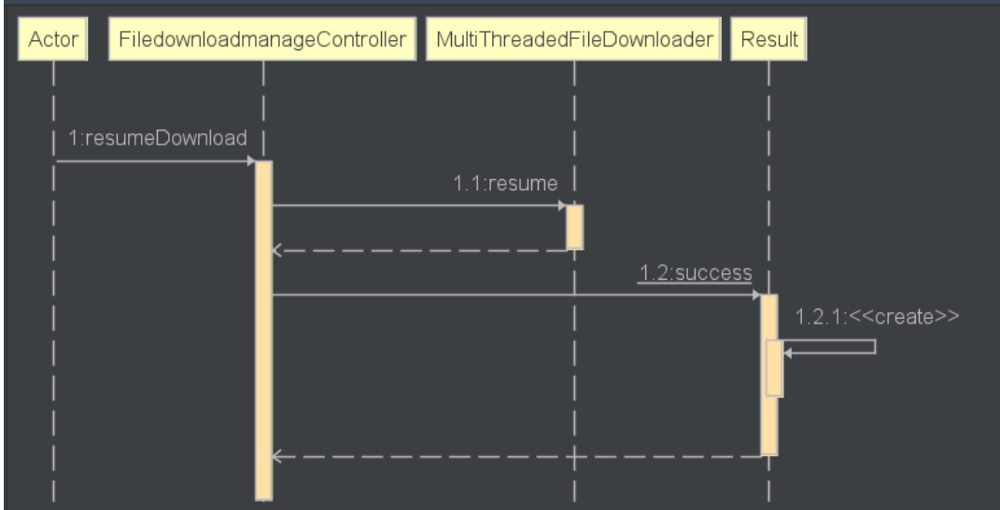

### deleteFile
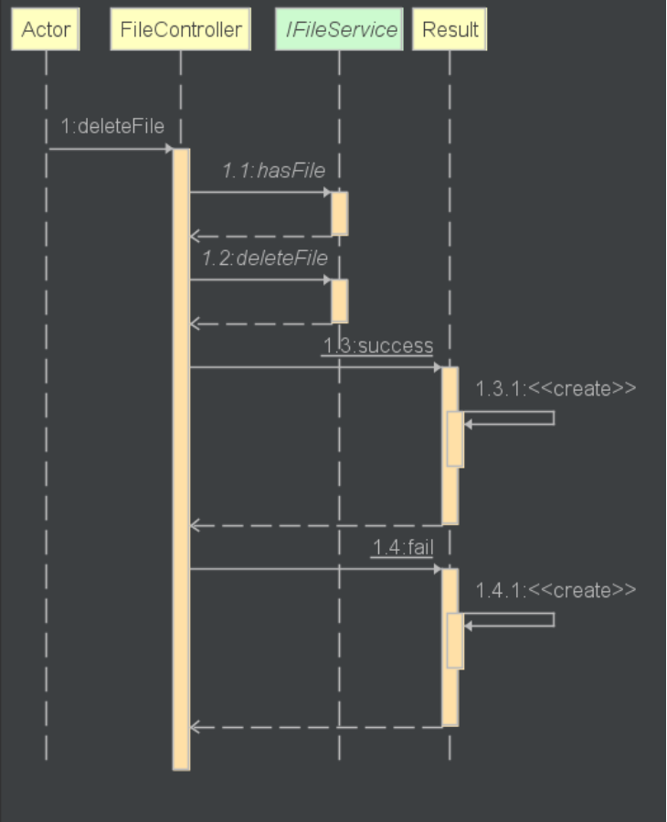

### select
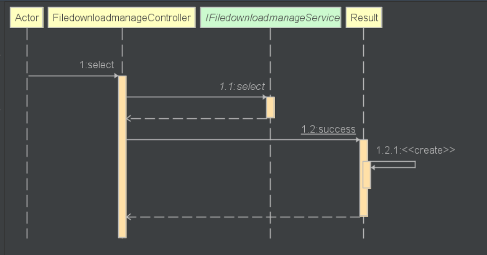

## Front-end interface design
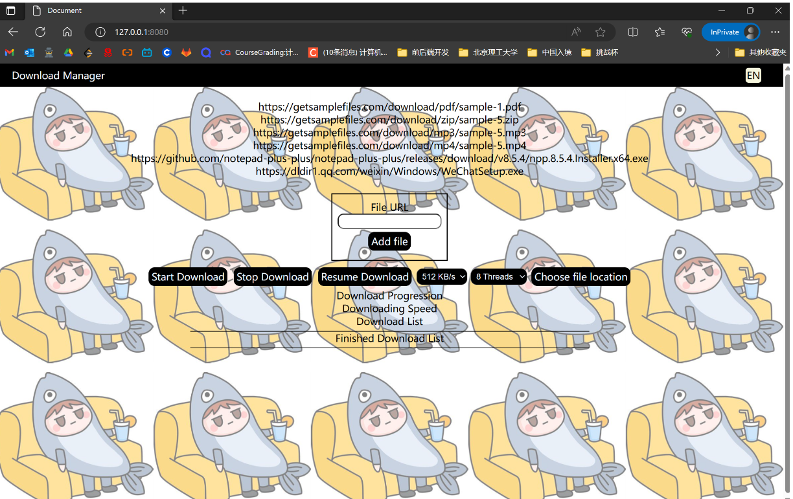
function explaination from left to right, up to down
1. language switching - Press to change language
2. add url - Input valid url and add into database
3. StartDownload - choose file to download, default download speed is 512KB/S and 8 threads
4. StopDownload - stop download
5. ResumeDownload - resume paused download
6. Download Speed - choose download speed, default is 512KB/s
7. Thread count - default is 8 threads

### download progress
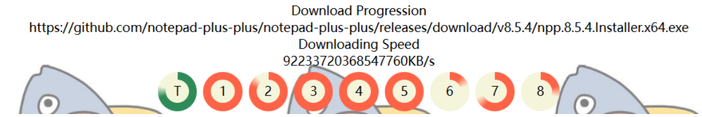
Orange colored means each thread process, green means total process

### download list
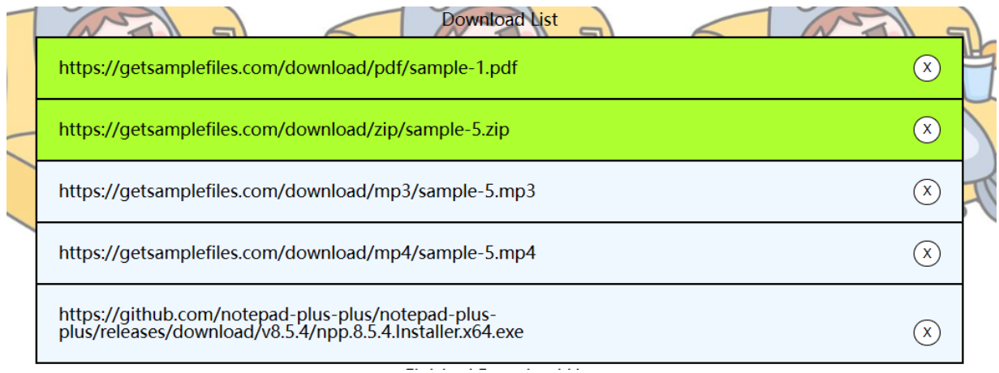
Able to choose which file to download, the delete button on the right to delete file from list

### downlaoded list
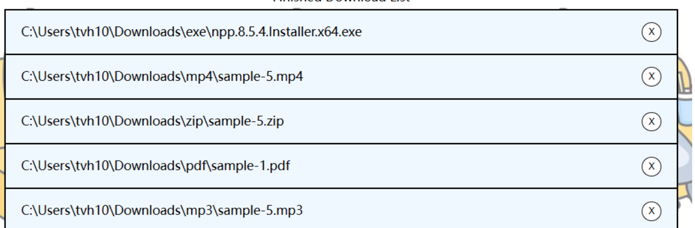
Shows the file location, let user to find the file easily

### alert notifications
Written in second iteration report
[SecondIteration](../Phase2/SecondIteration.md)

# JProfiler
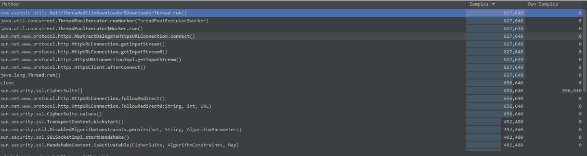

# Code Explanation
Visual Interface are implemented in second iteration
[SecondIteration](../Phase2/SecondIteration.md)

# Conclusion
 the final stage, I unified the parameters for the functionalities implemented in the previous three stages. This iterative approach proved to be convenient. Through these four iterations, I gained a profound understanding of the significance of proper sequence in the formal software development process.

For instance, in the development of this project, I initially dove into designing the frontend and backend without careful consideration of variable placement, database design, functional cohesion, and coupling. This led to the introduction of many additional functionalities to accommodate the previously poorly designed features, resulting in messy and non-standardized code.

Furthermore, my approach to software testing was not systematic, as I did not follow a step-by-step testing process. Instead, I relied on printing outputs while writing code, which is not a professional practice. Despite encountering numerous challenges and mistakes during this software engineering experiment, I have gained valuable insights. I believe that the lessons learned from these failures will enable me to make corrections and avoid similar pitfalls in future projects.