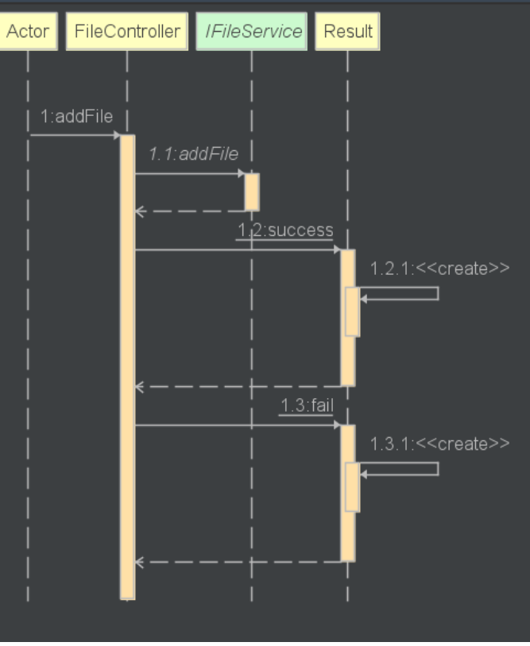
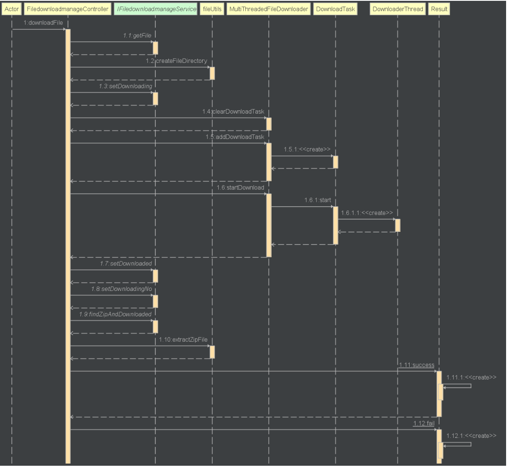
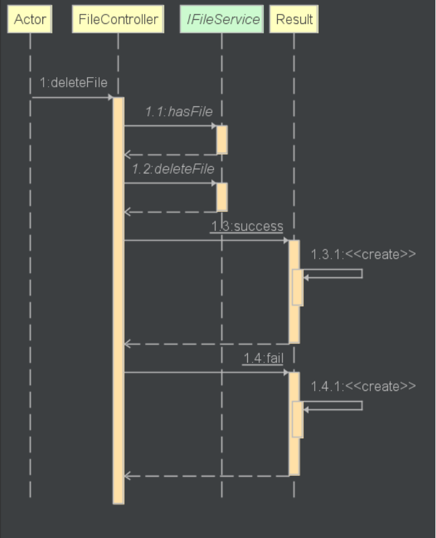
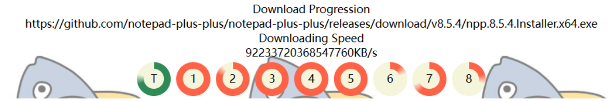
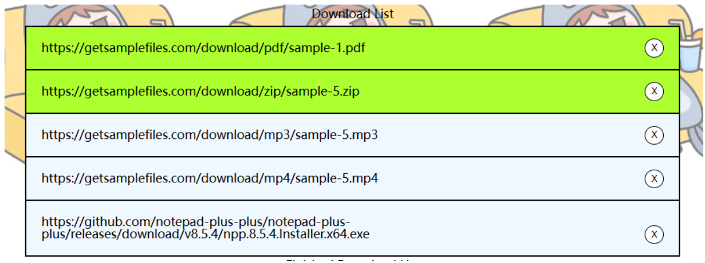

# 各个模块的预期耗时和实际耗时

| PSP                                     | Personal Software Process Stages        | 预估耗时（分钟） | 实际耗时（分钟） |
| --------------------------------------- | --------------------------------------- | ---------------- | ---------------- |
| Planning                                | 计划                                    | 20               | 20               |
| · Estimate                              | · 估计这个任务需要多少时间              | 900             | 800             |
| Development                             | 开发                                    | 1080             |                  |
| · Analysis                              | · 需求分析 (包括学习新技术)             | 120              | 120              |
| · Design Spec                           | · 生成设计文档                          | 30               | 30               |
| · Design Review                         | · 设计复审 (和同事审核设计文档)         | 20               | 20               |
| · Coding Standard                       | · 代码规范 (为目前的开发制定合适的规范) | 20               | 20               |
| · Design                                | · 具体设计                              | 60              | 60              |
| · Coding                                | · 具体编码                              | 60              | 60              |
| · Code Review                           | · 代码复审                              | 30               | 30               |
| · Test                                  | · 测试（自我测试，修改代码，提交修改）  | 120              | 120              |
| Reporting                               | 报告                                    | 120              | 120              |
| · Test Report                           | · 测试报告                              | 120              | 120              |
| · Size Measurement                      | · 计算工作量                            | 90               | 120              |
| · Postmortem & Process Improvement Plan | · 事后总结, 并提出过程改进计划          | 90               | 60               |
|                                         | 合计                                    | 1000             | 970                 |

# 解题思路
1. 通过阅读第四阶段的要求，可以了解到要将前三次迭代的功能进行可视化设计，也就是设计用户界面，重新对应用的用户需求进行**功能分析与建模**
	1. 重点在于功能分析以及建模，在课堂上我们学习过功能分析与建模是用来识别和描述系统、产品或流程功能的方法。我要确定系统中各个组成部分之间的相互关系。
	2. 明确设计各个功能的输入和输出关系
	3. 然后对功能进行建模，我需要将功能进行画出图形例如：功能流程图、用例图等等。
2. 软件设计需要进行扩充，加入用户交互界面设计和界面模块的设计
	1. 交互界面设计主要基于网页进行设计，并且以简单为主。

# 设计实现过程
## 前后端接口设计
### File Controller

| 名称       | URL                                       | 类型 | 输入 | 输出             | 功能                                           |
| ---------- | ----------------------------------------- | ---- | ---- | ---------------- | ---------------------------------------------- |
| addFile    | http://127.0.0.1:8080/api/file/add        | GET  | url  | Result           | 调用IFileService的addFile()                      |
| haveFile   | http://127.0.0.1:8080/api/file/hasFile    | GET  | url  | Result File      | 调用IFileService的hasFile() |
| AllFile    | http://127.0.0.1:8080/api/file/allFile    | GET  | 无   | Result List File | 调用IFileService的allFile()                           |
| deleteFile | http://127.0.0.1:8080/api/file/deleteFile | GET  | url  | Result File      | 调用IFileService的deleteFile()                           |

### Filedownloadmanage Controller

| 名称                  | URL                                                                | 类型 | 输入          | 输出                                  | 功能                                                                    |
| --------------------- | ------------------------------------------------------------------ | ---- | ------------- | ------------------------------------- | ----------------------------------------------------------------------- |
| selectFile            | http://127.0.0.1:8080/api/filedownloadmanage/select                | POST | url，hasClass | Result Filedownloadmanage             | 调用IFiledownloadmanageService的select()                                |
| downloadFile          | http://127.0.0.1:8080/api/filedownloadmanage/download              | POST | thread, speed | Result List Filedownloadmanage        | 前端传送thread, speed给后端并开始下载，调用getSelectedFileList和getFileUrl然后对他们进行setDownloading，startDownload然后setDownloaded，setDownloadingNo最后findZipAndDownload解压                                   |
| pauseDownload         | http://127.0.0.1:8080/api/filedownloadmanage/pauseDownload         | GET  | none          | Result File                           | 调用MultiThreadedFileDownloader的pause()                                |
| resumeDownload        | http://127.0.0.1:8080/api/filedownloadmanage/resumeDownload        | GET  | none          | Result File                           | 调用MultiThreadedFileDownloader的resume()                               |
| getCurrentDownloading | http://127.0.0.1:8080/api/filedownloadmanage/getCurrentDownloading | GET  | none          | String(file url)/ current no download | 调用MultiThreadedFileDownloader的getCurrentDownload()                   |
| getDownloadedFile     | http://127.0.0.1:8080/api/filedownloadmanage/getDownloadedFile     | GET  | none          | Result List File                      | 调用IFiledownloadmanageService的getAllDownloadFile()，然后调用getFile() |
| getThreadProcess      | http://127.0.0.1:8080/api/filedownloadmanage/getThreadProcess      | GET  | none          | Result List Long                      | 调用MultiThreadedFileDownloader的getThreadProcess()                                             |
| getDownloadSpeed      | http://127.0.0.1:8080/api/filedownloadmanage/getDownloadSpeed      | GET  | none          | Double                                | 调用MultiThreadedFileDownloader的getThreadDownloadSpeed()                                                          |

## 功能接口设计
### IFileService

| 接口名字   | 输入 | 输出                | 功能                                     |
| ---------- | ---- | ------------------- | ---------------------------------------- |
| addFile    | url  | Map(String, Object) | 将文件加入到数据库并返回的信息           |
| hasFile    | url  | File                | 检查数据库是否有该文件，并返回文件对象   |
| allFile    | 无   | List File           | 查找数据库里所有的文件并返回文件列表对象 |
| deleteFile | url  | boolean             | 删除数据库内文件对象                                         |

### IFiledownloadmanageService

| 接口名字             | 输入          | 输出                    | 功能                                     |
| -------------------- | ------------- | ----------------------- | ---------------------------------------- |
| get                  | url           | Filedownloadmanage      | 从数据库filedownloadmanage获取特定对象   |
| addFile              | fileId, url   | Boolean                 | 加入数据到filedownloadmanage             |
| select               | url, selected | Boolean                 | 将特定对象改为以选择                     |
| getSelectedFileList  | 无            | List Filedownloadmanage | 从filedownloadmanage获取以选择的对象     |
| getFile              | url           | File                    | 从file获取特定对象                       |
| setDownloading       | url           | Filedownloadmanage      | 将特定对象改为正在下载                   |
| setDownloadingNo     | url           | Filedownloadmanage      | 将特定对象改为不在下载                   |
| setDownloaded        | url           | Filedownloadmanage      | 将特定对象改为已完成下载                 |
| getAllDownloadedFile | 无            | List Filedownloadmanage | 从filedownloadmanage获取已完成下载的对象 |
| findZipAndDownloaded | 无            | List File               | 从file获取以下载并且是zip文件列表        | 

## 功能用例图
### 添加按钮

### 下载按钮

### 暂停按钮

### 继续按钮

### 删除按钮

### 选择按钮

## 前端界面设计

功能介绍，从上到下，左到右
1. 语言切换 - 点击EN按钮即可将语言切换为中文
2. 添加url - 输入正确URL格式后点击按钮即可将URL添加到数据库准备对其进行下载
3. 开始下载StartDownload - 选择文件后点击下载并开始进行下载，默认速度和线程为512KB/s和8各线程
4. 停止下载StopDownload - 开始下载文件后可以点击停止下载，若没有任务则提示
5. 继续下载ResumeDownload - 停止下载任务后可以点击继续下载，若没有下载任务则提示
6. 下载速度 - 可以选择特定下载速度，默认为512KB/s
7. 线程数量 - 可以选择特定线程数量，默认为8个
以上就是交互式界面的主要功能。

并且在下载的时候的可视化界面

### 下载进度

橙色的代表各个线程的下载进度，绿色的代表总进度，这样的可视化可以让用户直观的观察到下载进度。

### 下载列表

下载列表可以点击选择哪一些文件要进行下载，右部份的删除按钮可以将任务删除。

### 完成下载列表

完成下载的文件会显示他的文件路径，方便用户去进行文件查找。

### 提示
在第二阶段的报告已经进行编写
[第二阶段报告](../Phase2/第二阶段迭代.md)

# 使用Jprofiler进行性能监控
各个类对内存消耗如下：

可以发现MultiThreadedFileDownloader消耗内存量最大，其次是线程，然后到Http连接

# 代码说明
并没有新增代码，因为在迭代二已经进行可视化了，已经在第二阶段迭代报告里面编写
[第二阶段报告](../Phase2/第二阶段迭代.md)

# 总结与反思
最后一个阶段是将前3个阶段的功能再次统一参数的传入，这样的迭代方式比较方便，经过了这4个迭代，我理解了在正式软件开发过程次序的重要新，比如说我因为在开发这个项目的时候就直接使用前后端设计了，并没有妥善的安排变量的时候，数据库的设计，功能的内聚性以及耦合性，所以在开发过程中出现了许多多于的功能来配合之前设计错的功能，导致代码不整齐规范。然后就是在进行软件测试方面也没有正确的一步一步进行，只是通过边编写代码边测试print出来，非常的不专业，这次的软件工程实验我获益良多，虽然走错的路非常的多，但我相信下一次能够通过这次的一些失败修正避免再次发生。