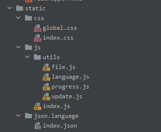
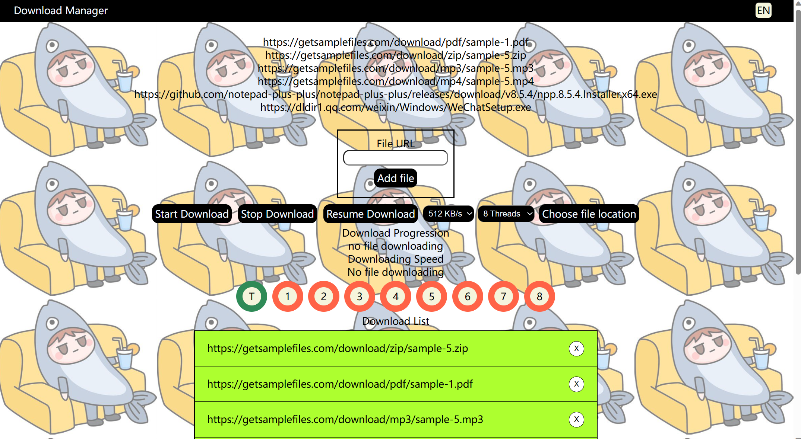
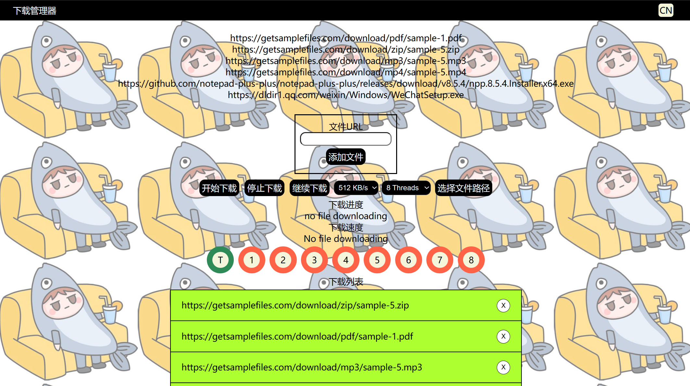
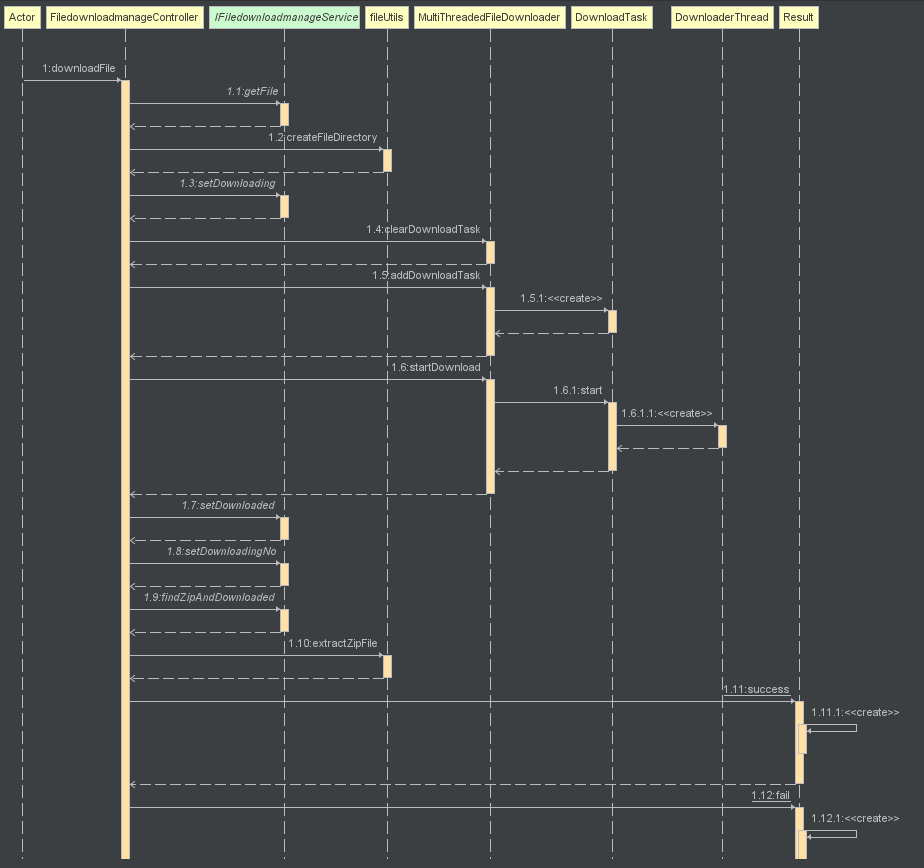
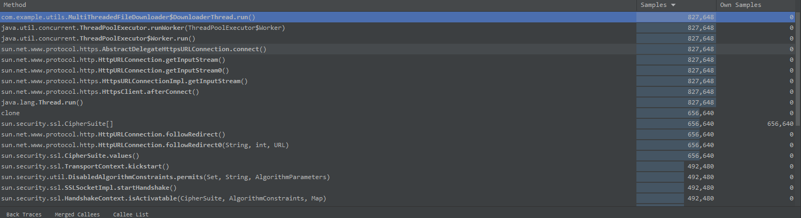

# 各个模块的预期耗时和实际耗时

| PSP                                     | Personal Software Process Stages        | 预估耗时（分钟） | 实际耗时（分钟） |
| --------------------------------------- | --------------------------------------- | ---------------- | ---------------- |
| Planning                                | 计划                                    | 60               | 50               |
| · Estimate                              | · 估计这个任务需要多少时间              | 1440             | 1080             |
| Development                             | 开发                                    | 1080             |                  |
| · Analysis                              | · 需求分析 (包括学习新技术)             | 360              | 360              |
| · Design Spec                           | · 生成设计文档                          | 60               | 60               |
| · Design Review                         | · 设计复审 (和同事审核设计文档)         | 60               | 60               |
| · Coding Standard                       | · 代码规范 (为目前的开发制定合适的规范) | 60               | 60               |
| · Design                                | · 具体设计                              | 120              | 100              |
| · Coding                                | · 具体编码                              | 480              | 480              |
| · Code Review                           | · 代码复审                              | 60               | 60               |
| · Test                                  | · 测试（自我测试，修改代码，提交修改）  | 360              | 360              |
| Reporting                               | 报告                                    | 360              | 360              |
| · Test Report                           | · 测试报告                              | 180              | 180              |
| · Size Measurement                      | · 计算工作量                            | 90               | 120              |
| · Postmortem & Process Improvement Plan | · 事后总结, 并提出过程改进计划          | 90               | 60               |
|                                         | 合计                                    | 2340             | 2350                 |

# 解题思路
1. 查看了第三阶段的要求
	1. 提供下载速度限制和带宽分配功能
		1. 通过网上查询相关资料，了解到可以通过让线程停止一段时间再继续下载并可以达到限制速度的功能
	2. 支持下载任务的自动分类和归档功能
		1. 根据文件的类型下载到相应的文件夹里面
		2. 文件类型分别有（pdf, zip, exe, mpeg, gif, jpeg, png等等）
		3. 下载后根据文件类型分类到不同的文件夹里面例如：C:/Users/tvh10/downloads/pdf/文件.pdf
	3. 实现下载任务的自动解压和安装功能
		1. 通过网上查询java解压的方法，并在所有文件下载完成后对文件进行解压
	4. 提供多语言支持
		1. 通过网上查询，可以利用一个文件包含多种语言，再切换语言的时候调用文件内给出的语言并且使用。
		2. 在主页面提供按钮点击切换中文和英文，调用json文件获取。

# 设计实现过程
## 前端设计


在第二阶段迭代的基础上增加了language.js和index.json用以实现支持多语言技术

英文


中文


## 解压zip文件的顺序图


下载完毕后，会调用fileUtils对zip文件进行解压。

# 使用Jprofiler进行性能监控
各个类对内存消耗如下：

可以发现MultiThreadedFileDownloader消耗内存量最大，其次是线程，然后到Http连接

# 新增代码说明
## 限制速度
```java

```
限制速度代码出现问题，需要进行更正。

## 自动分类和归档
```java
String home = System.getProperty("user.home");  
  
for (Filedownloadmanage f: fileList  
     ) {  
    File newFile = iFiledownloadmanageService.getFile(f.getFileUrl());  
    fileInfoList.add(newFile);  
  
    //创建文件夹for对应的文件类型 10/7/2023 文件归档  
    String filePath = home + "\\Downloads\\" + newFile.getFileType();  
    fileUtils.createFileDirectory(filePath);  
  
}
```

```java
public boolean createFileDirectory(String filePath) {  
    File directory = new File(filePath);  
  
    return directory.mkdirs();  
}
```

在点击下载按钮后，会对文件类型进行获取，并且在下载目录创建不同类型的文件夹例如：exe，pdf，jpg等等的

## 解压zip文件
```java
String zipFilePath = "C:\\Users\\tvh10\\Downloads\\zip\\sample-5.zip";  
String destinationFolder = "C:\\Users\\tvh10\\Downloads\\zip\\unzip";  
  
try (ZipInputStream zis = new ZipInputStream(new FileInputStream(zipFilePath))) {  
    ZipEntry entry;  
  
    while ((entry = zis.getNextEntry()) != null) {  
        String entryName = entry.getName();  
        File entryFile = new File(destinationFolder, entryName);  
  
        if (entry.isDirectory()) {  
            // Create directory if it doesn't exist  
            entryFile.mkdirs();  
        } else {  
            // Create parent directories if they don't exist  
            entryFile.getParentFile().mkdirs();  
  
            // Extract the file  
            try (OutputStream os = new FileOutputStream(entryFile)) {  
                byte[] buffer = new byte[1024];  
                int length;  
                while ((length = zis.read(buffer)) > 0) {  
                    os.write(buffer, 0, length);  
                }  
            }  
        }  
  
        zis.closeEntry();  
    }  
  
    System.out.println("Zip file extracted successfully.");  
} catch (IOException e) {  
    e.printStackTrace();  
}
```

当所有文件下载完毕后，会对数据库进行查找文件类型为zip的并且是已经下载的文件进行解压，放入同样文件夹底下的unzip文件夹。

## 支持多语言
```js
export function changeLanguage(){  
    if(langBtn.innerHTML === "CN"){  
        langBtn.innerHTML = "EN"  
        loadPageLanguage(languageUrl,"en")  
    }else{  
        langBtn.innerHTML = "CN"  
        loadPageLanguage(languageUrl,"cn")  
  
    }  
}  
  
function loadPageLanguage(languageUrl, language){  
    $.getJSON(languageUrl, function(data){  
        let languageObj = data[language][0];  
  
        $("#headerTitle").text(languageObj.title);  
        $("#box-title").text(languageObj.box_title);  
        $("#addFile").text(languageObj.add_file_btn);  
        $("#btn-download").text(languageObj.start_download_btn);  
        $("#btn-stop").text(languageObj.stop_download_btn);  
        $("#btn-resume").text(languageObj.resume_download_btn);  
        $("#btn-choose-file").text(languageObj.file_location);  
        $("#download-progress-text").text(languageObj.download_progress);  
        $("#download-speed-text").text(languageObj.download_speed);  
        $("#download-list").text(languageObj.download_list);  
        $("#fin-download-list").text(languageObj.fin_download_list);  
        });  
}
```

```json
{  
  "cn" : [{  
    "title" : "下载管理器",  
    "box_title": "文件URL",  
    "add_file_btn" : "添加文件",  
    "start_download_btn": "开始下载",  
    "stop_download_btn": "停止下载",  
    "resume_download_btn": "继续下载",  
    "file_location": "选择文件路径",  
    "download_progress": "下载进度",  
    "download_speed": "下载速度",  
    "download_list": "下载列表",  
    "fin_download_list": "完成下载列表"  
  }],  
  "en" : [{  
    "title" : "Download Manager",  
    "box_title": "File URL",  
    "add_file_btn" : "Add file",  
    "start_download_btn": "Start Download",  
    "stop_download_btn": "Stop Download",  
    "resume_download_btn": "Resume Download",  
    "file_location": "Choose file location",  
    "download_progress": "Download Progression",  
    "download_speed": "Downloading Speed",  
    "download_list": "Download List",  
    "fin_download_list": "Finished Download List"  
  }]  
}
```
点击切换按钮会调用相应的语言，实现了简单支持多语言。

# 总结于反思
本次迭代新增的功能难度也不低，需要限制速度这一方面我做了将近2小时也没有完成，所以先对任务2，3，4进行功能上的实现。对于文件的自动归档并没有太大的问题，因为在迭代一的时候已经设计了数据库并且会对文件类型进行保存，所以在归档的时候实现起来简单。接下来就是第三个功能-对zip文件进行解压，解压方面我在网上查询了相关资料，解压的原理也就是读取内容并写入到一个新的文件，这一方面我使用了java的包帮助实现。最后的语言切换由于以前有过相关的经验，所以使用了前端的js帮助实现了中英文的语言切换。
总的来说，这一个迭代是比较顺利的，因为有之前的数据库设计，技术上学习一些并可以实现了。
但是我学习到的一点就是数据库真的需要在开发前精心的去设计，否则会有很多无用的数据库操作。还有就是设计模式也需要多多的学习，才能够使得代码更加的整齐。